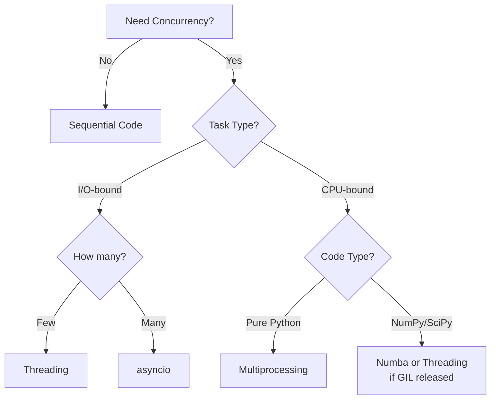

# Parallelization & Concurrency in Python

## Why Parallelization Matters

Modern computers have multiple CPU cores, but a single-threaded Python program uses only one. For compute-intensive tasks like data processing, scientific simulations, or batch operations, parallelization can dramatically reduce execution time.

**Example**: Processing 1000 images sequentially might take 10 minutes. With 8 cores working in parallel, it could take just over 1 minute.

## Concurrency vs. Parallelism

These terms are often confused:

- **Concurrency**: Multiple tasks making progress (not necessarily simultaneously)
- **Parallelism**: Multiple tasks executing simultaneously on different CPU cores

**Analogy**: 
- Concurrency: One chef cooking multiple dishes, switching between them
- Parallelism: Multiple chefs each cooking different dishes simultaneously

## The Python Global Interpreter Lock (GIL)

### What is the GIL?

The **Global Interpreter Lock** is a mutex that protects Python objects, preventing multiple threads from executing Python code simultaneously. Only one thread can execute Python bytecode at a time, even on multi-core systems.

:::note What is a Mutex?
A **mutex** (mutual exclusion) is like a lock on a door. Only one thread can hold the lock at a time. When a thread wants to access protected data, it must first acquire the mutex. Other threads must wait until the mutex is released. This prevents multiple threads from modifying the same data simultaneously, which would cause errors.
:::

### Why Does the GIL Exist?

1. **Memory Management**: Python uses reference counting for garbage collection. The GIL makes this thread-safe without complex locking
2. **Simplicity**: Makes CPython's C API easier to use
3. **Single-threaded Performance**: Eliminates overhead of fine-grained locking

### Impact on Your Code

```python
import threading
import time

def cpu_intensive_work():
    """Pure Python computation - affected by GIL"""
    total = 0
    for i in range(10_000_000):
        total += i * i
    return total

# Sequential execution
start = time.time()
result1 = cpu_intensive_work()
result2 = cpu_intensive_work()
sequential_time = time.time() - start

# Multi-threaded execution (still limited by GIL!)
start = time.time()
t1 = threading.Thread(target=cpu_intensive_work)
t2 = threading.Thread(target=cpu_intensive_work)
t1.start()
t2.start()
t1.join()
t2.join()
threaded_time = time.time() - start

print(f"Sequential: {sequential_time:.2f}s")
print(f"Threaded: {threaded_time:.2f}s")  # Similar time due to GIL!
```

:::warning GIL Limitation
For CPU-bound tasks (pure computation), Python threads do NOT provide parallel speedup due to the GIL. Use multiprocessing or Numba instead.
:::

## Threading in Python

### When to Use Threads

Threads are effective for **I/O-bound tasks** where the program spends time waiting:
- Network requests
- File I/O
- Database queries
- User input

During I/O operations, the GIL is released, allowing other threads to run.

### Thread Example: Concurrent File Downloads

```python
import threading
import requests
import time

urls = [
    "https://example.com/data1.csv",
    "https://example.com/data2.csv",
    "https://example.com/data3.csv",
    "https://example.com/data4.csv",
]

def download_file(url):
    """Download file - I/O bound, benefits from threading"""
    response = requests.get(url)
    filename = url.split("/")[-1]
    with open(filename, 'wb') as f:
        f.write(response.content)
    print(f"Downloaded {filename}")

# Sequential downloads
start = time.time()
for url in urls:
    download_file(url)
sequential_time = time.time() - start

# Concurrent downloads with threads
start = time.time()
threads = []
for url in urls:
    thread = threading.Thread(target=download_file, args=(url,))
    thread.start()
    threads.append(thread)

for thread in threads:
    thread.join()
threaded_time = time.time() - start

print(f"Sequential: {sequential_time:.2f}s")
print(f"Threaded: {threaded_time:.2f}s")  # Much faster!
```

### Thread Synchronization with Locks

When multiple threads access shared data, you need synchronization to avoid race conditions.

:::note What is a Race Condition?
A **race condition** occurs when multiple threads try to modify shared data at the same time, and the final result depends on the unpredictable timing of which thread runs when. 

**Example:** Two threads trying to increment a counter:
1. Thread A reads counter = 5
2. Thread B reads counter = 5 (before A writes!)
3. Thread A calculates 5 + 1 = 6, writes 6
4. Thread B calculates 5 + 1 = 6, writes 6
5. Result: counter = 6 (should be 7!)

The threads "race" each other, and the result is wrong. Locks prevent this by ensuring only one thread can access the data at a time.
:::

Here is a demonstration showing the difference between thread-safe and unsafe operations:

```python
import threading
import time

class BankAccount:
    def __init__(self, balance=0):
        self.balance = balance
        self.lock = threading.Lock()
    
    def deposit(self, amount, use_lock=True):
        if use_lock:
            with self.lock:
                current = self.balance
                time.sleep(0.0001)  # Simulate processing delay
                current += amount
                self.balance = current
        else:
            current = self.balance
            time.sleep(0.0001)  # Simulate processing - race condition likely!
            current += amount
            self.balance = current

# Test without locks - race conditions occur
account_unsafe = BankAccount(0)

def make_deposits_unsafe():
    for _ in range(100):
        account_unsafe.deposit(10, use_lock=False)

threads = [threading.Thread(target=make_deposits_unsafe) for _ in range(5)]
for t in threads:
    t.start()
for t in threads:
    t.join()

# Test with locks - thread-safe
account_safe = BankAccount(0)

def make_deposits_safe():
    for _ in range(100):
        account_safe.deposit(10, use_lock=True)

threads = [threading.Thread(target=make_deposits_safe) for _ in range(5)]
for t in threads:
    t.start()
for t in threads:
    t.join()

print(f"Expected balance: $5000 (5 threads × 100 deposits × $10)")
print(f"Without locks: ${account_unsafe.balance} (incorrect due to race conditions)")
print(f"With locks:    ${account_safe.balance} (correct!)")
```

:::warning Why the Artificial Delay?
The `time.sleep(0.0001)` call is added to make race conditions more visible. In real code, operations like reading from a database, performing calculations, or accessing disk would naturally create delays. During these delays, the operating system can switch to another thread, causing interleaving.

Without the sleep, the operations might complete so quickly that the thread scheduler doesn't switch threads, making the race condition harder to observe. However, the race condition still exists and will eventually cause bugs in production code where timing is less predictable.

**Key takeaway:** Race conditions are timing-dependent bugs. They may not show up during testing but can occur unpredictably in production. Always use proper synchronization when threads share mutable state.
:::

:::tip Thread Synchronization
Always use locks (or other synchronization primitives) when multiple threads modify shared data. Without locks, you get race conditions and unpredictable behavior.
:::

## Multiprocessing in Python

### When to Use Multiprocessing

For **CPU-bound tasks** (heavy computation), use multiprocessing to bypass the GIL. Each process has its own Python interpreter and memory space.

### Process Example: Parallel Computation

```python
import multiprocessing as mp
import numpy as np
import time

def compute_expensive(data_chunk):
    """CPU-intensive computation - benefits from multiprocessing"""
    result = np.zeros(len(data_chunk))
    for i in range(len(data_chunk)):
        # More expensive calculation - nested operations
        temp = data_chunk[i]
        for _ in range(100):  # Make it CPU-intensive
            temp = np.sin(temp) * np.cos(temp)
        result[i] = np.sum(temp)
    return result

if __name__ == '__main__':
    # Generate large dataset
    data = np.random.rand(8000, 100)
    chunks = np.array_split(data, 8)  # Split into 8 chunks

    # Sequential processing
    start = time.time()
    results_seq = [compute_expensive(chunk) for chunk in chunks]
    sequential_time = time.time() - start

    # Parallel processing with multiprocessing
    start = time.time()
    with mp.Pool(processes=8) as pool:
        results_par = pool.map(compute_expensive, chunks)
    parallel_time = time.time() - start

    print(f"Sequential: {sequential_time:.2f}s")
    print(f"Parallel (8 cores): {parallel_time:.2f}s")
    print(f"Speedup: {sequential_time / parallel_time:.2f}x")
```

**Expected output:**
```
Sequential: 7.82s
Parallel (8 cores): 1.35s
Speedup: 5.79x
```

:::tip Choosing the Right Task Size
Multiprocessing has overhead (process creation, data serialization). Only use it when the computation time significantly exceeds this overhead. If your speedup is less than 1x, your tasks are too small - either make them larger or use threading/numba instead.
:::

:::info Chunks vs. Processes
The number of chunks doesn't need to match the number of processes. `pool.map()` automatically distributes work:

- **Fewer chunks than processes** (4 chunks, 8 processes): Only 4 processes will be used
- **Equal chunks and processes** (8 chunks, 8 processes): Each process gets 1 chunk
- **More chunks than processes** (16 chunks, 8 processes): Better load balancing - processes pick up new chunks as they finish

**Best practice:** Use 2-4x more chunks than processes for better load balancing. If some chunks take longer, other processes won't sit idle:

```python
# Better load balancing - 32 chunks for 8 processes
chunks = np.array_split(data, 32)
with mp.Pool(processes=8) as pool:
    results = pool.map(compute_expensive, chunks)
```
:::

### Practical Example: Parallel Eigenvalue Computation

In structural dynamics and finite element analysis, you often need to compute eigenvalues for many similar matrices during parameter studies or optimization. Each eigenvalue computation is independent - perfect for parallelization.

**Python Implementation:**

```python
import numpy as np
import multiprocessing as mp
import time

def compute_single_eigenvalues(matrix):
    """Compute eigenvalues for a single matrix"""
    eigenvalues = np.linalg.eigvals(matrix)
    return np.sort(np.abs(eigenvalues))[::-1]

def compute_eigenvalues_sequential(matrices):
    """Sequential computation"""
    results = []
    for matrix in matrices:
        results.append(compute_single_eigenvalues(matrix))
    return results

def compute_eigenvalues_parallel(matrices, num_processes=None):
    """Parallel computation using multiprocessing"""
    with mp.Pool(processes=num_processes) as pool:
        results = pool.map(compute_single_eigenvalues, matrices)
    return results

if __name__ == '__main__':
    # Generate many matrices for parameter study
    matrices = [np.random.rand(200, 200) for _ in range(80)]
    
    # Sequential computation
    start = time.time()
    results_seq = compute_eigenvalues_sequential(matrices)
    sequential_time = time.time() - start
    
    # Parallel computation
    start = time.time()
    results_par = compute_eigenvalues_parallel(matrices, num_processes=8)
    parallel_time = time.time() - start
    
    print(f"Sequential: {sequential_time:.2f}s")
    print(f"Parallel (8 cores): {parallel_time:.2f}s")
    print(f"Speedup: {sequential_time / parallel_time:.2f}x")
```

**Output:**
```
Sequential: 3.03s
Parallel (8 cores): 1.05s
Speedup: 2.88x
```

:::warning Windows Requirement: if __name__ == '__main__':
On Windows, multiprocessing uses `spawn` instead of `fork` to create new processes. This means the entire script gets re-imported in each child process. **Always protect multiprocessing code with `if __name__ == '__main__':`** to prevent infinite process spawning.

This is not strictly required on Linux/macOS (which use `fork`), but it's good practice for cross-platform code.
:::

:::note Engineering Application
In structural dynamics, eigenvalue analysis determines natural frequencies and mode shapes. During design optimization or parameter studies, you compute eigenvalues for hundreds of slightly different structures. Parallelizing these independent computations dramatically reduces total analysis time.
:::

:::tip Process Overhead vs. Benefit
Parallelization with multiprocessing has overhead costs:
- Process creation (hundreds of milliseconds)
- Data serialization (pickling data to send to child processes)
- Inter-process communication

**Small problems** (20 matrices, 100×100): Overhead > computation time → slower than sequential (0.5x speedup)

**Medium-large problems** (80 matrices, 200×200): Computation time > overhead → significant speedup (2.88x)

**Large problems** (100 matrices, 300×300): Even better speedup (3.63x)!

Always profile before parallelizing. The sweet spot is many independent tasks with sufficient computation per task.
:::

### Advanced: Threading with Factorized Solvers (Guyan Reduction)

For problems where you solve many linear systems with the **same coefficient matrix but different right-hand sides**, you can use threading with factorized solvers. This is common in structural dynamics applications like Guyan reduction.

**Mathematical Background: Guyan Reduction**

Guyan reduction (static condensation) is used to reduce finite element models. The original system:

$$
\begin{bmatrix}
K_{mm} & K_{ms} \\
K_{sm} & K_{ss}
\end{bmatrix}
\begin{bmatrix}
u_m \\
u_s
\end{bmatrix}
=
\begin{bmatrix}
F_m \\
0
\end{bmatrix}
$$

Where:
- $K_{mm}$, $K_{ms}$, $K_{sm}$, $K_{ss}$ are stiffness matrix partitions
- $u_m$ are master (retained) degrees of freedom
- $u_s$ are slave (eliminated) degrees of freedom  
- $F_m$ are applied forces (no forces on slave DOFs)

**Condensation process:**

From the second equation: $K_{sm} u_m + K_{ss} u_s = 0$

Solving for slave DOFs: $u_s = -K_{ss}^{-1} K_{sm} u_m$

The key operation is computing the transformation matrix: $X = K_{ss}^{-1} K_{sm}$

This requires solving: $K_{ss} X = K_{sm}$

This is **multiple linear systems with the same matrix** $K_{ss}$ but different right-hand sides (columns of $K_{sm}$).

:::warning Important: u_m is Unknown at This Stage
At the condensation stage, we do not yet know $u_m$! We are computing the **reduction matrix** X = $K_{ss}^{-1} K_{sm}$ that will be used later when $u_m$ becomes known.

You might wonder: "Why not just multiply $K_{sm}$ with $u_m$ to get a normal $A \times x = b$ system?" The answer is that $u_m$ is the unknown we want to solve for in the actual analysis. First, we must condense the system by computing the transformation matrix X. Then, we substitute $u_s = -X u_m$ into the first equation to get the reduced system that can be solved for $u_m$.

The condensation is a **preprocessing step** that creates a smaller system. Once we solve that reduced system for $u_m$, we can compute $u_s$ using the reduction matrix we computed here.
:::

**Why Threading Works Here:**

For problems like Guyan reduction where you solve many columns with the same coefficient matrix, use **threading with factorized solvers**:

```python
from scipy.sparse import csc_matrix
from scipy.sparse.linalg import factorized
from joblib import Parallel, delayed
import numpy as np
import time

def compute_column(solve_func, B, col_idx):
    """Solve using pre-factorized matrix for a single column"""
    return solve_func(B[:, col_idx].toarray().ravel())

def parallel_solve_with_factorization(A, B, n_jobs=-1):
    """
    Solve A * X = B using factorization + threading.
    Factorize A once, then solve each column in parallel with threads.
    """
    A_csc = csc_matrix(A)
    B_csc = csc_matrix(B)
    
    # Factorize once - O(n³)
    solve = factorized(A_csc)
    
    # Solve columns in parallel using threads - each solve is O(n²)
    num_columns = B_csc.shape[1]
    X_cols = Parallel(n_jobs=n_jobs, prefer="threads")(
        delayed(compute_column)(solve, B_csc, i) for i in range(num_columns)
    )
    
    return np.column_stack(X_cols)

# Example: Simulate Guyan reduction problem
if __name__ == '__main__':
    # K_ss: slave stiffness matrix (sparse, 3000x3000)
    # K_sm: coupling matrix (sparse, 3000x500)
    # Solve K_ss * X = K_sm
    
    n_slave = 3000
    n_master = 500
    
    # Create TRULY sparse matrices (typical in FEM - only ~0.2% non-zero)
    # Simulate banded structure like in FEM
    from scipy.sparse import random
    density = 0.001  # Only 0.1% non-zero entries
    K_ss = random(n_slave, n_slave, density=density, format='csc')
    K_ss = K_ss + K_ss.T  # Make symmetric (typical for stiffness)
    K_ss = K_ss + csc_matrix(np.eye(n_slave) * 10)  # Add diagonal dominance
    
    K_sm = random(n_slave, n_master, density=density, format='csc')
    
    # Pre-factorize once (same cost for both approaches)
    print("Factorizing matrix...")
    solve = factorized(K_ss)
    
    # Sequential solve (only measure solving, not factorization)
    print("Sequential solving...")
    start = time.time()
    X_seq = np.column_stack([solve(K_sm[:, i].toarray().ravel()) 
                              for i in range(n_master)])
    seq_time = time.time() - start
    
    # Parallel solve with threading (measure only solving)
    print("Parallel solving...")
    start = time.time()
    X_cols = Parallel(n_jobs=8, prefer="threads")(
        delayed(compute_column)(solve, K_sm, i) for i in range(n_master)
    )
    X_par = np.column_stack(X_cols)
    par_time = time.time() - start
    
    print(f"\nMatrix size: {n_slave}x{n_slave}, solving for {n_master} columns")
    print(f"Sparsity: {K_ss.nnz / (n_slave**2) * 100:.3f}% non-zero")
    print(f"\nSolve phase only:")
    print(f"  Sequential:         {seq_time:.2f}s")
    print(f"  Parallel (threads): {par_time:.2f}s")
    print(f"  Speedup:            {seq_time / par_time:.2f}x")
```

**Performance:**
```
Matrix size: 3000x3000, solving for 500 columns
Sparsity: 0.203% non-zero

Solve phase only:
  Sequential:         1.61s
  Parallel (threads): 0.66s
  Speedup:            2.44x
```

:::note Why Measure Only Solve Phase?
We factorize the matrix **once** before timing. Both approaches use this same factorization, so including it in timing would hide the parallel benefit. The speedup comes from solving 500 columns in parallel using the pre-computed factorization.

In the full Guyan reduction workflow:
1. **Factorize** $K_{ss}$ once (expensive, O(n³), done once)
2. **Solve** for each column of $K_{sm}$ (cheaper, O(n²), done 500 times) ← **This parallelizes!**

Since factorization dominates for small problems but solving dominates when you have many columns, threading provides significant benefits for problems with many right-hand sides.
:::

**Why threading works here:**
1. **Sparse solvers release the GIL** - scipy.sparse.linalg calls C/Fortran libraries (SuperLU, UMFPACK)
2. **C code doesn't hold Python's lock** - Before calling C code, Python uses `Py_BEGIN_ALLOW_THREADS`
3. **Multiple threads run simultaneously** - While one thread executes C code (GIL released), other Python threads can run
4. **Factorize once, reuse many times** - Factorization is expensive (scales with n³), but each solve is cheap (scales with n²). For 100 columns, you do one expensive factorization, then 100 cheap solves that can run in parallel
5. **No pickling overhead** - threads share memory, unlike multiprocessing
6. **Sparse matrices** - realistic for FEM problems (95%+ zeros)

:::tip When Does Threading Beat Multiprocessing?
Threading works when **C/Fortran extensions release the GIL**:
- ✅ NumPy/SciPy operations (call BLAS/LAPACK/SuperLU)
- ✅ Numba-compiled functions (with `nogil=True`)
- ✅ C extensions that explicitly release GIL
- ❌ Pure Python code (loops, list comprehensions, etc.)

For pure Python computation, use multiprocessing. For NumPy/SciPy-heavy computation, threading can be faster (no pickling overhead)!
:::

## Processes vs. Threads

| Aspect | Threads | Processes |
|--------|---------|-----------|
| **GIL Impact** | Limited by GIL for CPU tasks | No GIL limitation |
| **Memory** | Shared memory space | Separate memory spaces |
| **Overhead** | Low overhead | Higher overhead (process creation) |
| **Data Sharing** | Easy (shared variables) | Requires IPC (pickling) |
| **Best For** | I/O-bound tasks | CPU-bound tasks |
| **Fault Isolation** | Crash affects all threads | Crash isolated to process |

## Async/Await (asyncio)

For I/O-bound tasks with many concurrent operations (like web scraping, API calls), `asyncio` is another concurrency approach alongside threading. Both handle I/O-bound work, but they differ in mechanism:

- **Threading**: OS-level threads, preemptive multitasking (OS decides when to switch)
- **asyncio**: Single thread with event loop, cooperative multitasking (you explicitly `await`)

**When to use asyncio instead of threading:**
- Very high concurrency (hundreds/thousands of operations)
- More control over task switching
- Lower memory overhead per concurrent operation

```python
import asyncio
import aiohttp
import time

async def fetch_url(session, url):
    """Asynchronously fetch a URL"""
    async with session.get(url) as response:
        data = await response.text()
        return len(data)

async def fetch_all_urls(urls):
    """Fetch multiple URLs concurrently"""
    async with aiohttp.ClientSession() as session:
        tasks = [fetch_url(session, url) for url in urls]
        results = await asyncio.gather(*tasks)
        return results

urls = [f"https://example.com/page{i}" for i in range(20)]

# Run async code
start = time.time()
results = asyncio.run(fetch_all_urls(urls))
async_time = time.time() - start

print(f"Fetched {len(results)} URLs in {async_time:.2f}s")
```

**When to use asyncio:**
- Many concurrent I/O operations (hundreds or thousands)
- Web scraping, API clients, network services
- More efficient than threads for very high concurrency

## Numba: Bypassing the GIL

[Numba](https://numba.pydata.org/) is a Just-In-Time (JIT) compiler that translates Python functions to optimized machine code. It can bypass the GIL for parallel execution.

### Why Numba is Important

1. **Releases the GIL**: Compiled code runs without GIL limitations
2. **Near-C Performance**: JIT compilation achieves C/Fortran speeds
3. **Easy to Use**: Add a decorator, minimal code changes
4. **NumPy Integration**: Works seamlessly with NumPy arrays

### Numba Example: Parallel Computation

```python
import numpy as np
import numba
import time

# Regular Python function
def monte_carlo_pi_python(n_samples):
    """Estimate π using Monte Carlo - pure Python"""
    inside = 0
    for _ in range(n_samples):
        x = np.random.random()
        y = np.random.random()
        if x*x + y*y <= 1.0:
            inside += 1
    return 4.0 * inside / n_samples

# Numba-optimized version
@numba.jit(nopython=True)
def monte_carlo_pi_numba(n_samples):
    """Estimate π using Monte Carlo - Numba optimized"""
    inside = 0
    for _ in range(n_samples):
        x = np.random.random()
        y = np.random.random()
        if x*x + y*y <= 1.0:
            inside += 1
    return 4.0 * inside / n_samples

# Numba parallel version
@numba.jit(nopython=True, parallel=True)
def monte_carlo_pi_parallel(n_samples):
    """Estimate π using Monte Carlo - parallel Numba"""
    inside = 0
    for _ in numba.prange(n_samples):  # Parallel loop
        x = np.random.random()
        y = np.random.random()
        if x*x + y*y <= 1.0:
            inside += 1
    return 4.0 * inside / n_samples

n_samples = 10_000_000

# Python version
start = time.time()
pi_python = monte_carlo_pi_python(n_samples)
python_time = time.time() - start

# Numba version
start = time.time()
pi_numba = monte_carlo_pi_numba(n_samples)
numba_time = time.time() - start

# Numba parallel version
start = time.time()
pi_parallel = monte_carlo_pi_parallel(n_samples)
parallel_time = time.time() - start

print(f"Python:          {python_time:.2f}s (π ≈ {pi_python:.5f})")
print(f"Numba:           {numba_time:.2f}s (π ≈ {pi_numba:.5f}) - {python_time/numba_time:.1f}x faster")
print(f"Numba Parallel:  {parallel_time:.2f}s (π ≈ {pi_parallel:.5f}) - {python_time/parallel_time:.1f}x faster")
```

### Numba for Scientific Computing

Numba is particularly valuable for:
- **Numerical algorithms** (integration, optimization, simulation)
- **Array operations** not covered by NumPy
- **Custom computations** on large datasets
- **Real-time processing** requirements

```python
import numpy as np
import numba

@numba.jit(nopython=True, parallel=True)
def parallel_stress_computation(displacements, elastic_modulus, cross_sections):
    """
    Compute stress in structural elements in parallel
    
    Parameters:
    - displacements: (n, 3) array of node displacements
    - elastic_modulus: (n,) array of E values
    - cross_sections: (n,) array of cross-sectional areas
    """
    n = displacements.shape[0]
    stresses = np.zeros(n)
    
    for i in numba.prange(n):  # Parallel loop - no GIL!
        strain = np.linalg.norm(displacements[i]) / 1.0  # Simplified
        stresses[i] = elastic_modulus[i] * strain
    
    return stresses

# Example usage
n_elements = 1_000_000
displacements = np.random.rand(n_elements, 3)
E = np.full(n_elements, 210e9)  # Steel
A = np.full(n_elements, 0.01)    # 1 cm²

stresses = parallel_stress_computation(displacements, E, A)
```

:::tip Numba Best Practices
1. Use `nopython=True` (or `@njit`) for best performance
2. Use `parallel=True` and `numba.prange()` for CPU-bound loops
3. Works best with NumPy arrays and numerical operations
4. First call is slow (JIT compilation), subsequent calls are fast
:::

## Choosing the Right Approach



**Quick Decision Guide:**
1. **I/O-bound** (network, files, database):
   - Few operations → `threading`
   - Many operations → `asyncio`
2. **CPU-bound** (computation, data processing):
   - Pure Python loops → `multiprocessing`
   - NumPy/SciPy computations → `numba` with `parallel=True`
   - NumPy/SciPy with GIL-released C code → `threading` can work (e.g., factorized solvers)
3. **Mixed workload** → Combine approaches (e.g., multiprocessing + Numba)

## Common Pitfalls

### 1. Using Threads for CPU-Bound Work
```python
# ❌ Bad: GIL prevents parallel speedup
def cpu_intensive():
    return sum(i*i for i in range(10_000_000))

threads = [threading.Thread(target=cpu_intensive) for _ in range(4)]
# No speedup due to GIL!
```

### 2. Not Handling Process Communication Overhead
```python
# ❌ Bad: Overhead dominates
with mp.Pool() as pool:
    # Each task is too small, overhead dominates
    results = pool.map(lambda x: x*2, range(1000))
```

### 3. Shared State Without Locks
```python
# ❌ Bad: Race condition
counter = 0

def increment():
    global counter
    for _ in range(100000):
        counter += 1  # Not atomic!

threads = [threading.Thread(target=increment) for _ in range(4)]
# counter will be wrong!
```

## Key Takeaways

1. **Python GIL**: Limits threading for CPU-bound tasks
2. **Threading**: Good for I/O-bound tasks (network, files)
3. **Multiprocessing**: Bypass GIL for CPU-bound tasks
4. **asyncio**: Efficient for many concurrent I/O operations
5. **Numba**: JIT compilation + parallel execution without GIL
6. **Lock shared state**: Always synchronize when threads modify shared data

:::tip Engineering Perspective
In scientific computing and data visualization:
- Use **multiprocessing** or **Numba** for heavy computations
- Use **threading** or **asyncio** for data loading/saving
- Consider **Dask** for distributed computing on clusters
- Profile first - parallelization adds complexity!
:::

## Further Reading

- [Python threading documentation](https://docs.python.org/3/library/threading.html)
- [Python multiprocessing documentation](https://docs.python.org/3/library/multiprocessing.html)
- [Numba documentation](https://numba.pydata.org/)
- [Real Python: Speed Up Your Python Program With Concurrency](https://realpython.com/python-concurrency/)
- [Understanding the Python GIL](https://realpython.com/python-gil/)

