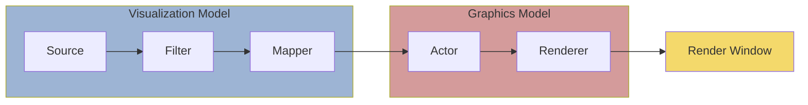
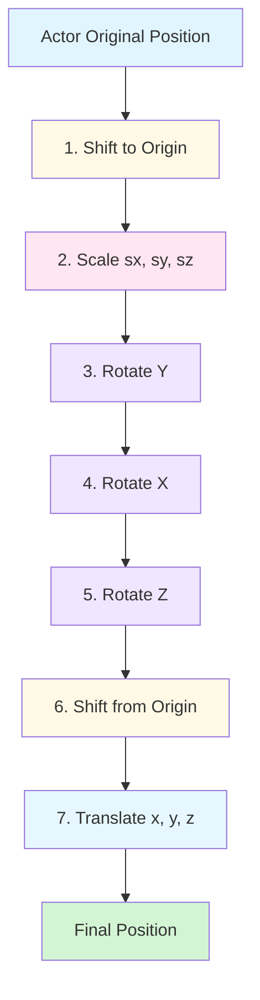

# 3D Visualization with VTK

## Overview

The Visualization Toolkit (VTK) is a powerful, open-source software system for computer graphics, visualization, and image processing. It provides a comprehensive framework for 3D visualization and is widely used in scientific and engineering applications, particularly for finite element analysis, computational fluid dynamics, and medical imaging.

VTK is designed to handle complex visualization tasks and can be integrated into custom applications once the fundamental concepts and methodology are understood. As a low-level library, VTK offers maximum flexibility and performance at the cost of increased complexity.

:::note Application Context
VTK is the foundation for many professional visualization tools including ParaView, VisIt, and 3D Slicer. Understanding VTK architecture provides insight into how modern scientific visualization systems work.
:::

:::info Prerequisites
This section assumes familiarity with basic Python programming and NumPy arrays. Knowledge of linear algebra and 3D coordinate systems will enhance your understanding of transformations and camera controls.
:::

## What is VTK?

VTK is:
- **Open-source** and freely available under BSD license
- **Object-oriented** software library written in C++ with Python bindings
- **Platform-independent** (Windows, Linux, macOS)
- **Multi-language** support (C++, Python, Java, Tcl)
- **Production-ready** with over 25 years of development and refinement

:::tip Engineering Relevance
VTK's architecture follows the pipeline pattern common in engineering workflows: data flows through a series of processing stages, from source through filters to final rendering. This mirrors typical FEM post-processing pipelines.
:::

VTK consists of two main components:
1. **Graphics Model** - renders graphical data into images
2. **Visualization Model** - transforms information into graphical data

This separation of concerns between data processing and rendering enables efficient visualization of large datasets commonly encountered in engineering simulations.



*Figure: VTK architecture showing the Visualization Model (data flow) and Graphics Model (rendering)*

## Installation

### Binary Installation

Download VTK from the official website:
```bash
# Official download page
https://vtk.org/download
```

### Python Installation

For Python users, the simplest installation method:
```bash
pip install vtk
```

### Building from Source (Advanced)

For C++ development or custom builds:
1. Download source code from vtk.org
2. Use CMake to configure the build
3. Important CMake settings:
   - `BUILD_SHARED_LIBS` - build shared libraries
   - `VTK_WRAP_PYTHON` - enable Python wrapping

## VTK Architecture

### Graphics Model

The Graphics Model consists of core objects that work together to create a rendered scene:

| Object | Purpose |
|--------|---------|
| `vtkActor` | Objects in the scene |
| `vtkLight` | Scene lighting |
| `vtkCamera` | Scene viewpoint |
| `vtkProperty` | Actor properties (color, material) |
| `vtkMapper` | Actor geometry |
| `vtkTransform` | Positioning of actors, cameras, lights |
| `vtkLookupTable` | Color palette for the scene |
| `vtkRenderer` | Performs scene rendering |
| `vtkRenderWindow` | Manages the graphics window |
| `vtkRenderWindowInteractor` | Handles keyboard and mouse input |

**The Graphics Model transforms graphical data into rendered images.**

### Visualization Model

The Visualization Model transforms raw information into graphical data using a data flow approach with two fundamental object types:

#### Data Objects (`vtkDataObject`)

Data objects represent different types of data with geometric and topological structure:
- **Points** - geometric positions
- **Cells** - topological atoms used for interpolation
- **Attributes** - scalars, vectors, tensors associated with points or cells

#### Process Objects (`vtkProcessObject`)

Process objects (also called filters) operate on data objects to generate new data objects. They contain the algorithms that transform data.

**The Visualization Pipeline is constructed by connecting process objects together.**

## VTK Dataset Types

VTK supports various dataset types to represent different kinds of data. The choice of dataset type affects both memory efficiency and computational performance.

:::note FEM Context
In finite element analysis, unstructured grids are most common because they can represent complex geometries with mixed element types (tetrahedra, hexahedra, pyramids, wedges). Structured grids are preferred for CFD applications on regular domains due to their computational efficiency.
:::

<div align="center">


*Figure: Overview of VTK dataset types - from regular structured grids to irregular unstructured grids*

</div>

### 1. Image Data (Structured Points)
- **Regular** in topology and geometry
- Examples: pixels, voxels
- Applications: CT, MRI imaging

### 2. Rectilinear Grid
- **Regular topology**, partially regular geometry
- Examples: pixels, voxels with variable spacing

### 3. Structured Grid
- **Regular topology**, irregular geometry  
- Examples: quadrilaterals, hexahedra
- Applications: fluid flow, heat transfer

### 4. Unstructured Points
- **No topology**, irregular geometry
- Examples: vertex, polyvertex
- Applications: data without inherent structure

### 5. Polygonal Data
- **Irregular** topology and geometry
- Examples: vertices, lines, polygons, triangle strips
- Applications: surface representations

### 6. Unstructured Grid
- **Irregular** topology and geometry
- Any combination of cell types
- Applications: finite element analysis, structural design

## VTK Cell Types

VTK provides both linear and non-linear cell types to represent finite elements accurately. Linear elements use straight edges and flat faces, while quadratic elements include mid-side nodes for curved geometry representation.

:::tip Element Selection
Linear elements (first-order) are computationally efficient but may require finer meshes for curved geometries. Quadratic elements (second-order) provide better accuracy with fewer elements but increase computational cost. The choice depends on your accuracy requirements and available computational resources.
:::

<div align="center">


*Figure: VTK linear cell types - vertex, line, triangle, quad, tetrahedron, hexahedron, wedge, pyramid*

</div>

**Linear cells:**
- Vertex, Polyvertex
- Line, Polyline
- Triangle, Triangle Strip
- Quad, Pixel
- Tetrahedron
- Hexahedron (Voxel)
- Wedge, Pyramid
<div align="center">


*Figure: VTK non-linear cell types - quadratic edge, quadratic triangle, quadratic quad, quadratic tetrahedron, quadratic hexahedron*

</div>


**Non-linear cells:**
- Quadratic edge, triangle, quad
- Quadratic tetrahedron, hexahedron
- And more specialized types

## Data Attributes

Data attributes can be associated with dataset points or cells:
<div align="center">


*Figure: VTK data attributes - scalars, vectors, normals, texture coordinates, tensors, and field data associated with the organizing structure*

</div>

- **Scalars** - single values (temperature, pressure, density)
- **Vectors** - magnitude and direction (velocity, momentum)
- **Normals** - direction vectors for shading (magnitude = 1)
- **Texture Coordinates** - map Cartesian space to texture space
- **Tensors** - generalizations of scalars and vectors (stress, strain)

## Visualization Pipeline

The visualization pipeline is constructed by connecting sources, filters, and mappers:

```
Source → Filter → Filter → Mapper → Actor → Renderer
```

<div align="center">


*Figure: VTK visualization pipeline showing the detailed flow from data sources through filters to rendering*

</div>

### Pipeline Components

**Sources:**
- Generate data by reading files or creating procedural geometry
- Examples: `vtkConeSource`, `vtkSphereSource`, readers

**Filters:**
- Take one or more data objects as input
- Produce one or more data objects as output
- Examples: `vtkContourFilter`, `vtkCutter`, `vtkGlyph3D`

**Mappers:**
- Transform data objects into graphical primitives
- Connect visualization pipeline to graphics pipeline
- Examples: `vtkPolyDataMapper`, `vtkDataSetMapper`

### Pipeline Execution

The pipeline uses a **demand-driven** execution model:
1. Actors request rendering via `Update()`
2. Request propagates through mappers to filters
3. Only "out of date" components are re-executed
4. Updates flow from sources to mappers
5. Finally, actors render the result

This automatic update mechanism ensures efficient rendering while keeping data synchronized.

:::info Performance Consideration
The demand-driven execution model is critical for handling large FEM datasets efficiently. Only modified pipeline components are recomputed, avoiding unnecessary recalculation of the entire visualization pipeline. This is particularly important for interactive post-processing of simulation results with millions of elements.
:::

## Basic VTK Program Structure

A minimal VTK program in Python:

```python
import vtk

# 1. Create source (geometry)
cone = vtk.vtkConeSource()
cone.SetHeight(3.0)
cone.SetRadius(1.0)
cone.SetResolution(10)

# 2. Create mapper
mapper = vtk.vtkPolyDataMapper()
mapper.SetInputConnection(cone.GetOutputPort())

# 3. Create actor
actor = vtk.vtkActor()
actor.SetMapper(mapper)

# 4. Create renderer
renderer = vtk.vtkRenderer()
renderer.AddActor(actor)
renderer.SetBackground(0.1, 0.2, 0.4)  # RGB background

# 5. Create render window
renderWindow = vtk.vtkRenderWindow()
renderWindow.AddRenderer(renderer)
renderWindow.SetSize(800, 600)

# 6. Create interactor
interactor = vtk.vtkRenderWindowInteractor()
interactor.SetRenderWindow(renderWindow)

# 7. Initialize and start
renderWindow.Render()
interactor.Start()
```

This program creates a 3D cone and displays it in an interactive window.

## Interactivity

### vtkRenderWindowInteractor

The `vtkRenderWindowInteractor` provides pre-defined event handling:

| Key/Action | Function |
|------------|----------|
| `j` / `t` | Switch between Joystick and Trackball mode |
| `c` / `a` | Switch between Camera and Actor mode |
| Left button | Rotate camera (around focal point) or actor |
| Middle button | Pan camera or translate actor |
| Right button | Zoom camera or scale actor |
| `s` / `w` | Switch between Surface and Wireframe |
| `r` | Reset camera |
| `f` | Fly to point under cursor |
| `p` | Pick operation |
| `3` | Toggle stereo 3D mode |

### Interactor Styles

Different interaction styles are available:

```python
# Set trackball camera style
style = vtk.vtkInteractorStyleTrackballCamera()
interactor.SetInteractorStyle(style)
```

Available styles:
- `vtkInteractorStyleTrackballCamera` - camera orbits around scene
- `vtkInteractorStyleTrackballActor` - manipulate individual actors
- `vtkInteractorStyleJoystickCamera` - joystick-like camera control
- `vtkInteractorStyleImage` - for 2D image viewing

## Camera Control

Cameras can be configured programmatically:

```python
# Create and configure camera
camera = vtk.vtkCamera()
camera.SetFocalPoint(0.0, 0.0, 0.0)
camera.SetPosition(5.0, 5.0, 5.0)
camera.SetViewUp(0.0, 1.0, 0.0)
camera.SetClippingRange(0.1, 100.0)

# Apply camera to renderer
renderer.SetActiveCamera(camera)
renderer.ResetCamera()

# Or modify existing camera
camera = renderer.GetActiveCamera()
camera.Azimuth(45)   # Rotate around scene
camera.Elevation(30)  # Change viewing angle
camera.Zoom(1.5)      # Zoom in
```

Camera transformations:
- `Azimuth(angle)` - rotate around the up vector
- `Elevation(angle)` - rotate around the cross product of view direction and up
- `Roll(angle)` - rotate around the view direction
- `Dolly(factor)` - move along view direction
- `Zoom(factor)` - change view angle (field of view)

<div align="center">


*Figure: VTK camera coordinate system showing position, focal point, and view-up vector*

</div>

## Lighting

VTK automatically creates default lighting, but custom lights can be added:

```python
# Create directional light (default)
light = vtk.vtkLight()
light.SetPosition(camera.GetPosition())
light.SetFocalPoint(camera.GetFocalPoint())
light.SetColor(1.0, 1.0, 1.0)  # White light
light.SwitchOn()

renderer.AddLight(light)

# Create positional light (spotlight effect)
spotlight = vtk.vtkLight()
spotlight.PositionalOn()
spotlight.SetPosition(5.0, 5.0, 5.0)
spotlight.SetFocalPoint(0.0, 0.0, 0.0)
spotlight.SetConeAngle(30)  # Spotlight cone angle
spotlight.SetColor(1.0, 0.0, 0.0)  # Red light

renderer.AddLight(spotlight)
```

Light types:
- **Directional** (default) - parallel rays from infinity
- **Positional** - point light source with attenuation
- **Spotlight** - positional with cone angle constraint

## Actor Properties and Transformation

### Positioning and Orientation

Actors can be transformed in 3D space:

```python
actor.SetPosition(x, y, z)
actor.AddPosition(dx, dy, dz)

actor.RotateX(angle)  # Degrees
actor.RotateY(angle)
actor.RotateZ(angle)
actor.SetOrientation(rx, ry, rz)

actor.SetScale(sx, sy, sz)
actor.SetOrigin(x, y, z)  # Rotation center
```

**Transformation order:** VTK applies transformations in this sequence:
1. Shift to Origin
2. Scale
3. Rotate Y
4. Rotate X
5. Rotate Z
6. Shift from Origin
7. Translate



*Figure: VTK actor transformation pipeline - transformations are applied in this specific order*

### Visual Properties

```python
# Get property object
property = actor.GetProperty()

# Surface properties
property.SetOpacity(0.5)        # 0=transparent, 1=opaque
property.SetAmbient(0.3)        # Ambient lighting coefficient
property.SetDiffuse(0.6)        # Diffuse lighting coefficient
property.SetSpecular(0.8)       # Specular lighting coefficient
property.SetSpecularPower(50)   # Specular highlight sharpness

# Color (if no scalar data)
property.SetColor(1.0, 0.0, 0.0)  # RGB red
property.SetAmbientColor(0.1, 0.1, 0.1)
property.SetDiffuseColor(0.8, 0.0, 0.0)
property.SetSpecularColor(1.0, 1.0, 1.0)

# Representation
property.SetRepresentationToSurface()    # Solid surface
property.SetRepresentationToWireframe()  # Wire frame
property.SetRepresentationToPoints()     # Point cloud

# Line width and point size
property.SetLineWidth(2.0)
property.SetPointSize(5.0)

# Visibility
actor.VisibilityOn()
actor.VisibilityOff()
```

### Scalar Visibility

When scalar data is present, it controls coloring:

```python
# Ignore scalar data and use actor color
mapper.ScalarVisibilityOff()
actor.SetColor(0.0, 0.0, 1.0)

# Use scalar data for coloring (default)
mapper.ScalarVisibilityOn()
```

## Color Mapping

Color mapping converts scalar values to colors using lookup tables:

```python
# Create lookup table
lut = vtk.vtkLookupTable()
lut.SetNumberOfColors(256)
lut.SetHueRange(0.0, 0.667)  # Blue to red
lut.Build()

# Apply to mapper
mapper.SetLookupTable(lut)
mapper.SetScalarRange(0.0, 1.0)  # Data range

# Choose scalar mode
mapper.SetScalarModeToUsePointData()  # Use point scalars
mapper.SetScalarModeToUseCellData()   # Use cell scalars
```

### Scalar Bar Actor

Display a color legend:

```python
scalarBar = vtk.vtkScalarBarActor()
scalarBar.SetLookupTable(mapper.GetLookupTable())
scalarBar.SetTitle("Temperature [K]")

# Position and size (normalized viewport coordinates)
scalarBar.GetPositionCoordinate().SetCoordinateSystemToNormalizedViewport()
scalarBar.GetPositionCoordinate().SetValue(0.85, 0.1)
scalarBar.SetWidth(0.1)
scalarBar.SetHeight(0.8)

# Orientation
scalarBar.SetOrientationToVertical()

renderer.AddActor(scalarBar)
```

## Visualization Techniques

### Contouring

Extract isosurfaces from scalar fields:

```python
# Create contour filter
contours = vtk.vtkContourFilter()
contours.SetInputConnection(source.GetOutputPort())

# Generate evenly spaced contours
contours.GenerateValues(10, 0.0, 1.0)  # 10 contours from 0 to 1

# Or set individual contour values
contours.SetValue(0, 0.25)
contours.SetValue(1, 0.50)
contours.SetValue(2, 0.75)

# Create mapper and actor
mapper = vtk.vtkPolyDataMapper()
mapper.SetInputConnection(contours.GetOutputPort())
mapper.SetScalarRange(0.0, 1.0)

actor = vtk.vtkActor()
actor.SetMapper(mapper)
```

### Glyphs

Visualize data with oriented, scaled symbols:

```python
# Create glyph source (arrow, cone, sphere, etc.)
arrow = vtk.vtkArrowSource()

# Create glyph filter
glyph = vtk.vtkGlyph3D()
glyph.SetInputConnection(dataSource.GetOutputPort())
glyph.SetSourceConnection(arrow.GetOutputPort())

# Configure glyphs
glyph.SetVectorModeToUseVector()      # Orient by vector data
glyph.SetScaleModeToScaleByVector()   # Scale by vector magnitude
glyph.SetScaleFactor(0.1)             # Scaling factor
glyph.SetColorModeToColorByScalar()   # Color by scalar data

# Create mapper and actor
mapper = vtk.vtkPolyDataMapper()
mapper.SetInputConnection(glyph.GetOutputPort())

actor = vtk.vtkActor()
actor.SetMapper(mapper)
```

### Cutting Planes

Extract cross-sections through data:

```python
# Define cutting plane
plane = vtk.vtkPlane()
plane.SetOrigin(0.0, 0.0, 0.0)
plane.SetNormal(1.0, 0.0, 0.0)  # Cut perpendicular to X

# Create cutter
cutter = vtk.vtkCutter()
cutter.SetInputConnection(dataSource.GetOutputPort())
cutter.SetCutFunction(plane)

# Multiple parallel cuts
cutter.GenerateValues(5, -1.0, 1.0)

# Create mapper and actor
mapper = vtk.vtkPolyDataMapper()
mapper.SetInputConnection(cutter.GetOutputPort())

actor = vtk.vtkActor()
actor.SetMapper(mapper)
```

### Warping

Deform geometry based on displacement vectors:

```python
# Add displacement vectors to data
displacements = vtk.vtkFloatArray()
displacements.SetNumberOfComponents(3)
displacements.SetName("Displacement")

for i in range(numPoints):
    displacements.InsertNextTuple3(dx[i], dy[i], dz[i])

polydata.GetPointData().SetVectors(displacements)

# Create warp filter
warp = vtk.vtkWarpVector()
warp.SetInputData(polydata)
warp.SetScaleFactor(10.0)  # Amplification factor

# Create mapper and actor
mapper = vtk.vtkDataSetMapper()
mapper.SetInputConnection(warp.GetOutputPort())

actor = vtk.vtkActor()
actor.SetMapper(mapper)
```

## Unstructured Grids

Create and visualize arbitrary cell combinations:

```python
# Create points
points = vtk.vtkPoints()
points.InsertNextPoint(0.0, 0.0, 0.0)
points.InsertNextPoint(1.0, 0.0, 0.0)
points.InsertNextPoint(1.0, 1.0, 0.0)
points.InsertNextPoint(0.0, 1.0, 0.0)
# ... more points

# Create unstructured grid
ugrid = vtk.vtkUnstructuredGrid()
ugrid.SetPoints(points)

# Insert cells
# Hexahedron (8 point IDs)
ugrid.InsertNextCell(vtk.VTK_HEXAHEDRON, 8, [0,1,2,3,4,5,6,7])

# Tetrahedron (4 point IDs)
ugrid.InsertNextCell(vtk.VTK_TETRA, 4, [0,1,2,4])

# Pyramid (5 point IDs)
ugrid.InsertNextCell(vtk.VTK_PYRAMID, 5, [0,1,2,3,4])

# Optimize memory
ugrid.Squeeze()

# Visualize
mapper = vtk.vtkDataSetMapper()
mapper.SetInputData(ugrid)

actor = vtk.vtkActor()
actor.SetMapper(mapper)
```

## Reading and Writing Data

### Reading Files

VTK provides readers for many file formats:

```python
# STL files (stereolithography)
stlReader = vtk.vtkSTLReader()
stlReader.SetFileName("model.stl")

# VTK legacy files
vtkReader = vtk.vtkPolyDataReader()
vtkReader.SetFileName("data.vtk")

# VTK XML files
xmlReader = vtk.vtkXMLPolyDataReader()
xmlReader.SetFileName("data.vtp")

# Use in pipeline
mapper = vtk.vtkPolyDataMapper()
mapper.SetInputConnection(stlReader.GetOutputPort())
```

Common VTK readers:
- `vtkSTLReader` - STL files
- `vtkPolyDataReader` - VTK legacy polydata
- `vtkStructuredGridReader` - VTK structured grids
- `vtkUnstructuredGridReader` - VTK unstructured grids
- `vtkXML*Reader` - VTK XML formats

### Writing Files

Export data to files:

```python
# Write VTK legacy format
writer = vtk.vtkPolyDataWriter()
writer.SetInputConnection(filter.GetOutputPort())
writer.SetFileName("output.vtk")
writer.SetFileTypeToBinary()
writer.Write()

# Write VTK XML format
xmlWriter = vtk.vtkXMLPolyDataWriter()
xmlWriter.SetInputConnection(filter.GetOutputPort())
xmlWriter.SetFileName("output.vtp")
xmlWriter.Write()

# Write STL
stlWriter = vtk.vtkSTLWriter()
stlWriter.SetInputConnection(filter.GetOutputPort())
stlWriter.SetFileName("output.stl")
stlWriter.Write()
```

## Additional Actors

### XY Plot Actor

Create 2D plots within 3D scene:

```python
xyplot = vtk.vtkXYPlotActor()
xyplot.AddInputConnection(probeFilter.GetOutputPort())

# Position (normalized viewport coordinates)
xyplot.GetPositionCoordinate().SetValue(0.0, 0.67, 0)
xyplot.GetPosition2Coordinate().SetValue(1.0, 0.33, 0)

# Configure plot
xyplot.SetXValuesToArcLength()
xyplot.SetTitle("Pressure vs. Arc Length")
xyplot.SetXTitle("Arc Length")
xyplot.SetYTitle("Pressure [Pa]")
xyplot.SetXRange(0.0, 1.0)
xyplot.SetYRange(0.0, 100.0)

renderer.AddActor(xyplot)
```

### Cube Axes Actor

Add annotated axes to scene:

```python
cubeAxes = vtk.vtkCubeAxesActor()
cubeAxes.SetBounds(data.GetBounds())
cubeAxes.SetCamera(renderer.GetActiveCamera())

# Appearance
cubeAxes.SetFlyModeToOuterEdges()
cubeAxes.SetLabelFormat("%.2f")
cubeAxes.GetXAxesLinesProperty().SetColor(1, 0, 0)
cubeAxes.GetYAxesLinesProperty().SetColor(0, 1, 0)
cubeAxes.GetZAxesLinesProperty().SetColor(0, 0, 1)

renderer.AddActor(cubeAxes)
```

## Screenshots and Image Export

Capture rendered images:

```python
# Create window-to-image filter
windowToImage = vtk.vtkWindowToImageFilter()
windowToImage.SetInput(renderWindow)
windowToImage.ReadFrontBufferOff()  # Read from back buffer

# Save as PNG
pngWriter = vtk.vtkPNGWriter()
pngWriter.SetInputConnection(windowToImage.GetOutputPort())
pngWriter.SetFileName("screenshot.png")
pngWriter.Write()

# Save as JPEG
jpegWriter = vtk.vtkJPEGWriter()
jpegWriter.SetInputConnection(windowToImage.GetOutputPort())
jpegWriter.SetFileName("screenshot.jpg")
jpegWriter.SetQuality(95)  # 0-100
jpegWriter.Write()
```

## Resources and Documentation

- **Official Website:** https://vtk.org
- **VTK Users Guide:** https://vtk.org/vtk-users-guide/
- **VTK Textbook:** https://vtk.org/vtk-textbook/
- **Examples:** https://kitware.github.io/vtk-examples/site/Python/
- **API Documentation:** https://vtk.org/doc/nightly/html/

## Next Steps

Now that you understand VTK fundamentals, explore PyVista for a more Pythonic and beginner-friendly interface to VTK's powerful capabilities. PyVista simplifies many common visualization tasks while maintaining VTK's full functionality.

See the [PyVista documentation](./3d-visualization-pyvista.md) for a higher-level approach to 3D visualization.
