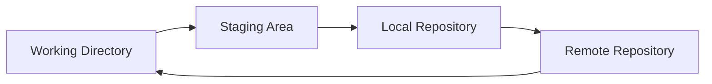

# Visualization & Data Processing  
Master Mechanical Engineering · 3rd Semester

**Lecture 1: Programming Fundamentals & Tools**  
Instructor: Stefan Oberpeilsteiner

---

## Today's Agenda
- Organization & grading
- Programming paradigms & structured programming
- C++ & Python fundamentals
- **Git & GitHub workflow** 🔧
- **Development environment setup** 💻
- **Kickoff assignment** 🚀
- **Hands-on practice** ⚡

---

## Course Goals
- Build **robust data pipelines**
- Create **clear visualizations**
- Work with **3D content** (VTK, PyVista, glTF)
- Design **interactive UIs** (Qt/PyQt, Dash, …)
- Practice **version control** & reproducibility

---

## Our Workflow
1. Script & tasks in **GitHub** (Markdown)
2. Work in **fork/branch → PR**
3. Review → Merge
4. Slides also from **Markdown** (Marp)

**📖 Detailed guide:** [Development Tools & Workflow](https://soberpe.github.io/visdat-course/tools-workflow/tools-workflow-overview)

---

## Programming Paradigms
- **Procedural**: step-by-step
- **OOP**: state + behavior
- **Functional**: pure functions

> In practice we mix them pragmatically.

---

## Structured Programming
- **Sequence** (statements in order)
- **Selection** (`if`, `switch`)
- **Iteration** (`for`, `while`, `do`)

```cpp
for (int i=0; i<5; ++i) {
  if (i % 2 == 0) continue;
  std::cout << i << " ";
}
```
```python
for i in range(5):
    if i % 2 == 0:
        continue
    print(i, end=" ")
```

---

## C++ Motivation
- Performance, control, ecosystem
- Often used to wrap low-level libs

**Goal:** read core syntax & patterns.

**📖 Deep dive:** [C++ Guide](https://soberpe.github.io/visdat-course/cpp/cpp-overview)

---

## Python Motivation
- Fast to write, batteries included
- Great for data & prototyping

**Goal:** write small tools and use libs.

**📖 Deep dive:** [Python Guide](https://soberpe.github.io/visdat-course/python/python-overview)

---

## C++ Toolchain
Preprocessor → Compiler → Linker → Binary

```bash
g++ main.cpp -O2 -std=c++17 -o app
./app
```

---

## Preprocessor
```cpp
#include <iostream>
#define SIZE 256
#ifdef DEBUG
  #define LOG(x) std::cerr << x << "\n"
#else
  #define LOG(x) do{}while(0)
#endif
```

---

## C++: Basics
```cpp
int age = 30;
double pi = 3.14159;
bool ok = true;
char c = 'A'; // 65
```

- case-sensitive, `;` ends statements
- `//` or `/* */` comments

---

## C++: Arrays & Strings
```cpp
int a[3] = {2,3,5};
char s[] = "hello";
```

**Pitfall:** arrays decay to pointers in many contexts.

---

## C++: Pointers
```cpp
int x = 42;
int* p = &x;
*p = 7;               // write through pointer
std::cout << *p;      // read through pointer
```

- `a[i] == *(a + i)`

---

## C++: References
```cpp
int x = 10;
int& r = x;
r = 20; // x becomes 20
```

- Syntactic sugar over pointers (cannot be reseated).

---

## C++: Functions
```cpp
int max2(int a, int b) {
  return (a > b) ? a : b;
}
```

- pass-by-value by default
- multiple outputs via refs/pointers

---

## C++: Enums & Structs
```cpp
enum class Color { Blue, Red, Yellow, Green };

struct Person {
  std::string name;
  int age;
};
```

---

## C++: Control Flow
```cpp
for (int i=0; i<3; ++i) {
  if (i == 1) continue;
  std::cout << i;
}
```

Also: `while`, `do { } while`, `switch`.

---

## C++: std::vector & std::string
```cpp
#include <vector>
#include <string>
std::vector<int> v{1,2,3};
v.push_back(4);
std::string s = "hello";
s += " world";
```

---

## C++: Header / Source Split
```cpp
// math.hpp
int sumsq(int n);
```
```cpp
// math.cpp
int sumsq(int n){ int s=0; for(int i=0;i<=n;i++) s+=i*i; return s; }
```
```cpp
// main.cpp
#include "math.hpp"
#include <iostream>
int main(){ std::cout << sumsq(5); }
```

---

## C++: Compile Multiple Files
```bash
g++ -c math.cpp -o math.o
g++ -c main.cpp -o main.o
g++ math.o main.o -o app
```

---

## C++: const & constexpr
```cpp
const double Pi = 3.14159;
constexpr int N = 256; // compile-time constant
```

---

## C++: Pass by Ref vs Value
```cpp
void inc_by_ref(int& x){ ++x; }
void inc_by_val(int x){ ++x; }
```

---

## C++: Simple Class
```cpp
class Counter {
  int n{0};
public:
  void inc(){ ++n; }
  int value() const { return n; }
};
```

---

## Python: Numbers & Operators
```python
x = 12
y = 3.14
print(x // 5)  # integer division
print(x << 1)  # bit shift
```

---

## Python: Strings
```python
s = "hello world"
print(s[:5])        # 'hello'
print("world" in s) # True
```

---

## Python: Lists
```python
a = [2,3,5]
a.append(7)
a.extend([11,13])
print(a)  # [2,3,5,7,11,13]
```

---

## Python: Dicts & Tuples
```python
conf = {"mode": "fast", "retries": 3}
print(conf["mode"])
pt = (3, 4, 5)  # immutable
```

---

## Python: Reference Semantics
```python
a = [1,2,3]
b = a
b.append(4)
print(a)  # [1,2,3,4]
```

Use `copy()` or slicing to copy lists.

---

## Python: Functions
```python
def gcd(a, b):
    '''greatest common divisor'''
    while a:
        a, b = b % a, a
    return b
```

---

## Python: Files
```python
from pathlib import Path
p = Path("out.txt")
p.write_text("hello\n")
print(p.read_text())
```

---

## Python: Modules & Virtual Environments
```bash
# If Python is in PATH:
python -m venv .venv

# If Python is NOT in PATH (more common):
C:\Python313\python.exe -m venv .venv

# Activate virtual environment:
# Windows: .venv\Scripts\activate
# Linux/macOS: source .venv/bin/activate

# Install packages:
pip install numpy pandas matplotlib
```

**💡 Detailed setup:** [Python Virtual Environments Guide](https://soberpe.github.io/visdat-course/python/python-overview#virtual-environments)

---

## Python: argparse (CLI)
```python
import argparse
p = argparse.ArgumentParser()
p.add_argument("--n", type=int, default=5)
args = p.parse_args()
print(args.n)
```

---

## Python: List/Dict Comprehensions
```python
squares = [i*i for i in range(6)]
inv = {k: v for v, k in enumerate("abc")}
```

---

## Python: Exceptions
```python
try:
    1/0
except ZeroDivisionError as e:
    print("nope", e)
```

---

## Side-by-Side Example
**Goal:** print odd numbers from 0..9

```cpp
for (int i=0; i<10; ++i) {
  if (i % 2 == 1) std::cout << i << " ";
}
```
```python
print(*[i for i in range(10) if i % 2 == 1])
```

---

## 🏃‍♂️ Mini Exercise (5 min)
- Write a function that returns the **sum of squares** for numbers `0..n`.
- Do it in **C++** and **Python**.

**Solution next slide →**

---

## Solution: Sum of Squares

**C++:**
```cpp
int sum_of_squares(int n) {
    int sum = 0;
    for (int i = 0; i <= n; ++i) {
        sum += i * i;
    }
    return sum;
}
```

**Python:**
```python
def sum_of_squares(n):
    return sum(i**2 for i in range(n+1))
```

---

# 🔧 Git & GitHub
## Version Control for Engineers

---

## Why Git?
- **Track changes** in your code/documents
- **Collaborate** with teammates
- **Backup** and history
- **Branching** for experiments
- **Industry standard** everywhere

**📖 Complete guide:** [Git & Version Control](https://soberpe.github.io/visdat-course/tools-workflow/tools-workflow-overview#git--version-control)

---

## Git Workflow Overview


1. **Edit** files
2. **Stage** changes (`git add`)
3. **Commit** snapshot (`git commit`)
4. **Push** to remote (`git push`)

---

## Essential Git Commands
```bash
# Clone a repository
git clone https://github.com/user/repo.git

# Check status
git status

# Stage changes
git add filename.py
git add .  # all changes

# Commit with message
git commit -m "Add data processing function"

# Push to remote
git push origin main
```

---

## Branching Strategy
```bash
# Create and switch to new branch
git checkout -b feature/data-analysis

# Work on your changes...
# Commit your changes...

# Push branch
git push origin feature/data-analysis

# Create Pull Request on GitHub
```

---

## 🎯 Live Demo: Git Workflow
1. **Fork** course repository
2. **Clone** your fork
3. **Create branch** for assignment
4. **Make changes**
5. **Commit & push**
6. **Open Pull Request**

---

# 💻 Development Environment
## VS Code & Extensions

---

## Required VS Code Extensions
```
✅ C/C++ (Microsoft)
✅ C/C++ Themes (Microsoft)
✅ Git Graph (mhutchie)
✅ GitHub Pull Requests and Issues (GitHub)
✅ Marp for VS Code
✅ Python (Microsoft)
✅ Python Debugger (Microsoft)
✅ Python Environments (Microsoft)
✅ Pylance (Microsoft)
```

**💡 Installation guide:** [VS Code Setup](https://soberpe.github.io/visdat-course/tools-workflow/tools-workflow-overview#vs-code-setup)

---

## Python Environment Setup
```bash
# Create virtual environment (choose your method):

# Method 1: If Python is in PATH
python -m venv .venv

# Method 2: If Python is NOT in PATH (recommended)
C:\Python313\python.exe -m venv .venv

# Method 3: In VS Code (automatic detection)
# Ctrl+Shift+P → "Python: Create Environment"

# Activate virtual environment:
.venv\Scripts\activate          # Windows
source .venv/bin/activate       # macOS/Linux

# Install packages:
pip install numpy pandas matplotlib
```

---

# 🚀 Kickoff Assignment
## Your First GitHub Workflow

---

## Assignment Overview
**Goal:** Get familiar with our workflow

**Tasks:**
1. **Environment setup** (Git, VS Code, Python)
2. **Fork & clone** course repository
3. **Update README** with your info
4. **Create introduction** document
5. **Make Marp presentation** about yourself
6. **Submit Pull Request**

**🎯 Complete details:** [Kickoff Assignment](https://soberpe.github.io/visdat-course/tools-workflow/kickoff-assignment)

---

## Assignment Structure
```
📁 Your changes:
├── README.md (add your info)
├── 📁 docs/students/
│   └── [lastname]-introduction.md
└── 📁 slides/students/
    └── [lastname]-introduction.md
```

**Branch:** `assignment/kickoff-[your-name]`

---

## Git Workflow for Assignment
```bash
# 1. Fork repo on GitHub
# 2. Clone your fork
git clone git@github.com:[your-username]/visdat-course.git

# 3. Create branch
git checkout -b assignment/kickoff-john-doe

# 4. Make your changes...
# 5. Stage and commit
git add .
git commit -m "Add student introduction"

# 6. Push and create PR
git push origin assignment/kickoff-john-doe
```

---

## Grading Criteria (100 points)
| Criteria | Points | Description |
|----------|--------|-------------|
| **Environment Setup** | 20 | Git, VS Code, Python working |
| **Git Workflow** | 25 | Proper branching, commits, PR |
| **Documentation** | 25 | Well-written introduction |
| **Marp Presentation** | 20 | Functional slides |
| **Instructions** | 10 | All tasks completed |

---

# ⚡ Hands-on Time
## Let's Get Started!

---

## Today's Practice Session
1. **Set up environment** (30 min)
   - Install Git, VS Code, Python
   - Configure Git identity & Set up SSH keys

2. **Repository workflow** (20 min)
   - Fork course repository
   - Clone and create branch

3. **Complete assignment** (remaining time)
   - Create Marp presentation
   - Commit and push changes

---

## Getting Help
**During hands-on:**
- Raise your hand for help
- Work together (pair programming encouraged!)
- Check the detailed guides in documentation

**After class:**
- Course repository Issues
- Documentation reference

---

## Data Preview (Next Week)
Quick peek at what's coming:

```python
# Data I/O
import pandas as pd
df = pd.DataFrame([{"a":1,"b":2}])
df.to_csv("data.csv", index=False)

# Plotting
import matplotlib.pyplot as plt
plt.plot([0,1,2],[0,1,4])
plt.title("Quadratic")
plt.show()

# 3D Visualization
import pyvista as pv
sphere = pv.Sphere()
sphere.plot(show_edges=True)
```

---

## Next Week: Data Formats & Visualization
- **Data formats:** CSV, JSON, HDF5
- **Pandas & Polars** for data manipulation
- **Matplotlib & Plotly** for 2D plots
- **First data analysis** exercises

---

## Wrap-up & Questions
- **Assignment due:** In two weeks
- **Resources:** All documentation online
- **Questions?** Ask now or create GitHub Issues

**🎯 Remember:** 
- Fork → Branch → Commit → Push → PR
- Documentation is your friend
- Start early, ask questions!

---

## Thank you! 
### Let's build something awesome! 🚀

**Course repo:** https://github.com/soberpe/visdat-course  
**Documentation:** https://soberpe.github.io/visdat-course/