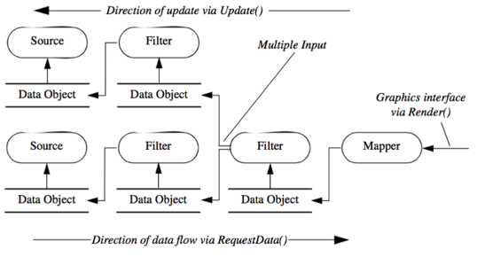
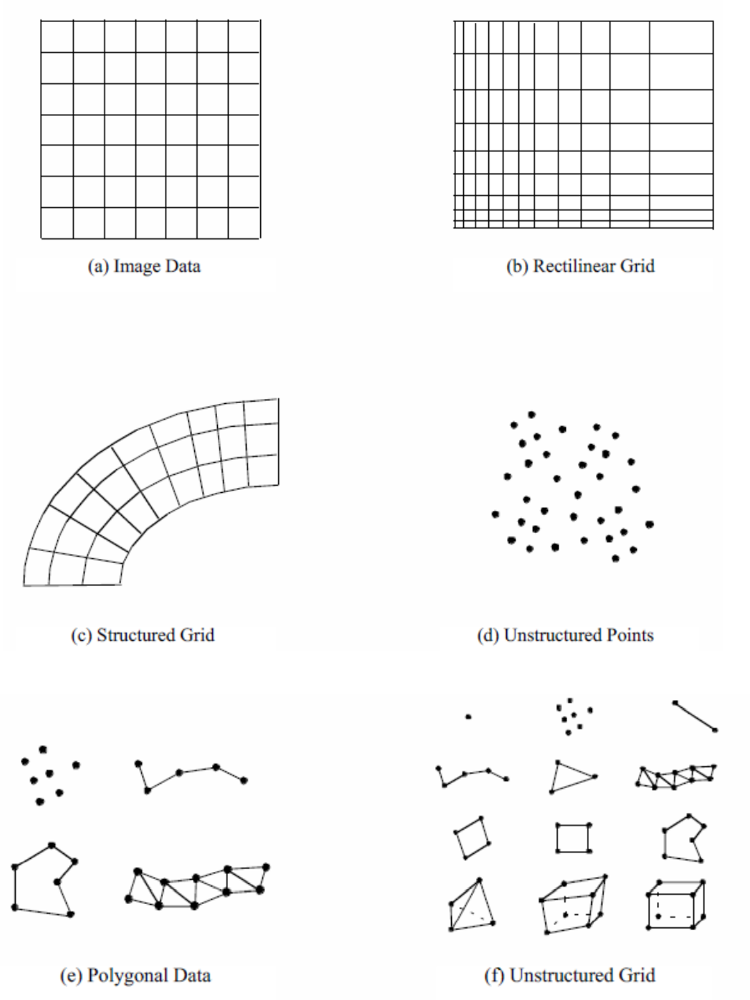
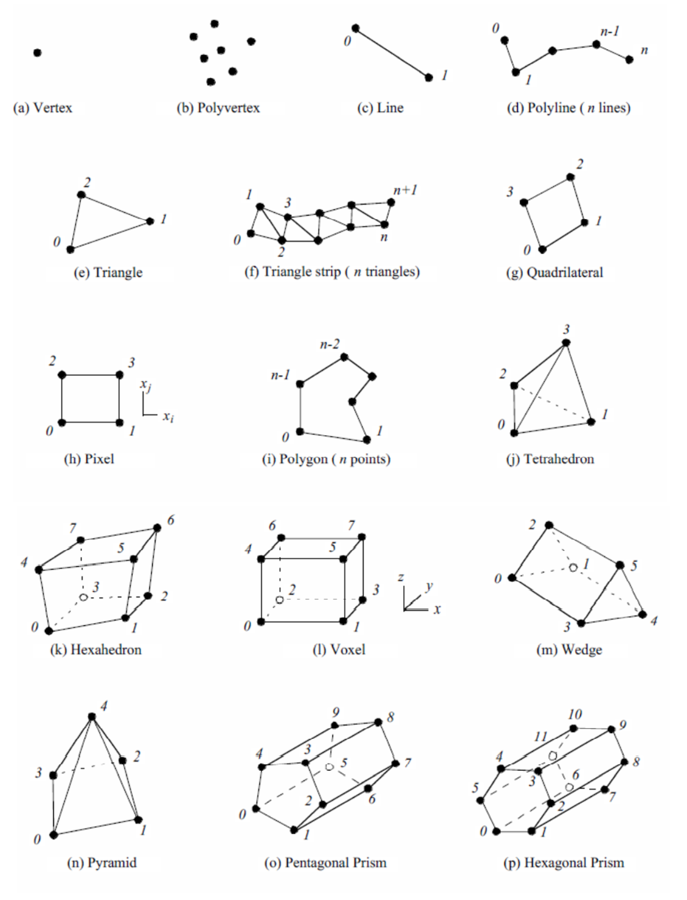
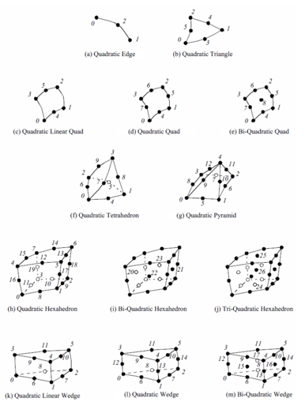
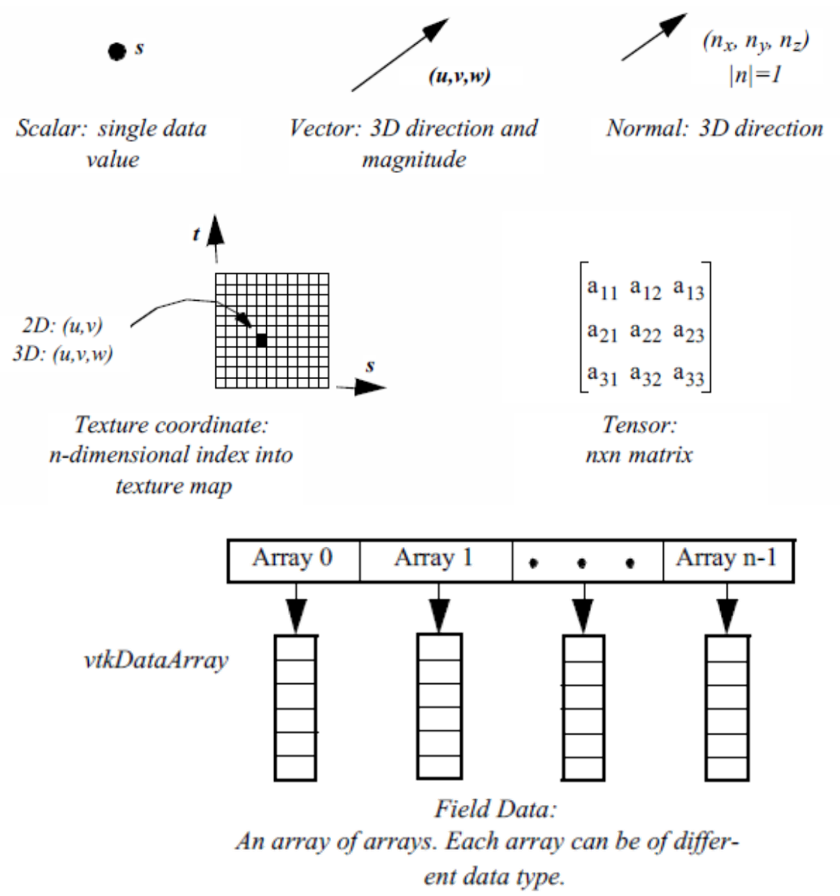

# Visualization with Matplotlib

- Introduction to matplotlib and its role in Python
- Design principles for effective plots
- Typical workflows and practical examples
- Integration with pandas
- Best practices and common pitfalls
<!--
Welcome to the lecture on visualization with matplotlib. This session explores the motivation for data visualization, key design principles, and practical usage of matplotlib in scientific data analysis.
-->
---

# Overview

- Why visualize data?
- What is matplotlib?
- Where does it fit in the Python ecosystem?
- How does it support data analysis?
---

# Why Visualize Data?

- Makes patterns and trends visible
- Supports exploration and hypothesis testing
- Communicates results clearly
- Helps avoid misinterpretation of raw numbers
---

# What is Matplotlib?

- The standard Python library for 2D plotting
- Flexible and widely used in science and engineering
- Foundation for other libraries (pandas, seaborn)
- Supports many chart types and customizations
<!--
Define matplotlib and its importance in the Python data ecosystem.
-->
---

# Where Does Matplotlib Fit?

- Integrates with pandas for tabular data
- Works with numpy for numerical analysis
- Used in Jupyter notebooks and scripts
- Basis for more advanced or interactive tools
<!--
Show how matplotlib connects with other Python tools and workflows.
-->
---

# How Does Matplotlib Support Data Analysis?

- Enables quick exploration with simple plots
- Provides control for publication-quality figures
- Allows customization for clarity and accessibility
- Facilitates reproducible workflows
---

# Why Use Matplotlib?

- Turns raw data into clear graphics
- Reveals patterns, trends, and relationships
- Supports hypothesis testing and sharing results
- Widely adopted and flexible
<!--
Emphasize the motivation for using matplotlib: making data visible and actionable.
-->
---

# Matplotlib Architecture

## Figure, Axes, Artist
- Figure: overall window or page
- Axes: coordinate system and plotting area
- Artist: any visible element (lines, text, legend)
- Hierarchical structure enables complex layouts
<!--
Explain the core objects in matplotlib and how they relate to each other. Use a diagram if possible.
-->
---

# API Styles: Pyplot vs. OO

- Pyplot: quick, stateful, interactive
- Object-Oriented (OO): recommended for scripts and complex layouts
- Choose one style per workflow
- Avoid mixing styles to prevent confusion
<!--
Clarify the difference between the two APIs and why the OO style is preferred for maintainable code.
-->
---

# Pyplot Example

## Quick Line Plot
```python
import matplotlib.pyplot as plt
plt.plot([0, 1, 2, 3], [0, 1, 4, 9])
plt.xlabel('X')
plt.ylabel('Y')
plt.title('Quick Line Plot')
plt.show()
```
---

# Object-Oriented Example

## Controlled Layout
```python
import matplotlib.pyplot as plt
fig, ax = plt.subplots()
ax.plot([0, 1, 2, 3], [0, 1, 4, 9], marker='o')
ax.set_xlabel('X')
ax.set_ylabel('Y')
ax.set_title('Line Plot (OO)')
fig.tight_layout()
plt.show()
```
---

# Typical Plot Types

- Line plot: trends over time or variable
- Scatter plot: relationships between variables
- Bar chart: compare categories
- Histogram: show distributions
- Multiple subplots: compare views side by side

---

# Example: Scatter Plot

```python
import matplotlib.pyplot as plt
x = [1, 2, 3, 4]
y = [4, 5, 6, 7]
plt.scatter(x, y, color='red')
plt.xlabel('X')
plt.ylabel('Y')
plt.title('Scatter Plot')
plt.show()
```

---

# Example: Multiple Subplots

```python
import matplotlib.pyplot as plt
import numpy as np
fig, axs = plt.subplots(2, 2, figsize=(8, 6))
x = np.linspace(0, 10, 100)
axs[0, 0].plot(x, np.sin(x))
axs[0, 0].set_title('Sine')
axs[0, 1].plot(x, np.cos(x))
axs[0, 1].set_title('Cosine')
axs[1, 0].plot(x, np.tan(x))
axs[1, 0].set_title('Tangent')
axs[1, 1].plot(x, -np.sin(x))
axs[1, 1].set_title('Negative Sine')
fig.tight_layout()
plt.show()
```
<!--
Demonstrate how to compare multiple views in one figure using subplots.
-->
---

# Design Principles

- Clarity: make the message obvious
- Accuracy: avoid misleading scales
- Aesthetics: support understanding
- Accessibility: use colorblind-friendly palettes
- Label axes, units, and add legends
<!--
Discuss what makes a visualization effective and trustworthy. Use examples of good and bad design.
-->
---

# Matplotlib in Data Analysis

- Used in Jupyter notebooks for exploration
- Used in scripts for automation and publication
- Plots display automatically in notebooks
- Always call plt.show() in scripts
- Save figures with plt.savefig()

---

# Integration with Pandas

- DataFrames have built-in plotting methods
- Use matplotlib as backend
- Quick exploration with df.plot()
- Advanced customization with returned Axes
```python
import pandas as pd
import matplotlib.pyplot as plt
df = pd.DataFrame({'x': [0, 1, 2, 3], 'y': [0, 1, 4, 9]})
ax = df.plot(x='x', y='y', kind='line', marker='o')
ax.set_title('Line Plot from DataFrame')
ax.set_xlabel('X')
ax.set_ylabel('Y')
plt.tight_layout()
plt.show()
```

---

# Common Pitfalls

- Mixing pyplot and OO styles
- Forgetting plt.show() in scripts
- Overlapping labels and titles
- Poor color choices
- Not labeling axes

---

# Recap

- Matplotlib is essential for scientific visualization in Python
- Understand the architecture: Figure, Axes, Artist
- Choose the right API style for your workflow
- Apply design principles for effective plots
- Integrate with pandas for data analysis
- Avoid common pitfalls

---

<!-- _class: lead -->

# Part II: 3D Visualization
## VTK, meshio, and PyVista

---

# Why 3D Visualization?

- **Engineering simulations** require 3D representation
- **Finite Element Analysis** results are inherently spatial
- **Modal analysis** shows 3D deformation patterns
- **CFD results** need volumetric visualization
- **Complex geometries** cannot be understood in 2D

<!--
Motivate the need for 3D visualization in mechanical engineering workflows
-->

---

# 3D Visualization Landscape

Three complementary tools for engineering visualization:

1. **VTK** - Low-level, powerful foundation
2. **meshio** - Universal format converter
3. **PyVista** - High-level, Pythonic interface

Together they form a complete FEM post-processing pipeline.

---

# The Visualization Toolkit (VTK)

- Open-source 3D graphics and visualization library
- Foundation for ParaView, VisIt, 3D Slicer
- 25+ years of development and refinement
- Industry standard for scientific visualization
- Written in C++ with Python bindings

---

# VTK: Why It Matters

**For Engineers:**
- Handle millions of finite elements efficiently
- Support all FEM cell types (hex, tet, wedge, pyramid)
- Production-ready for professional applications
- Maximum control over visualization pipeline

**For Students:**
- Understanding VTK = understanding ParaView internals
- Transferable skills to commercial software
- Foundation for custom post-processing tools

---

# VTK Architecture

**Two Main Components:**

1. **Visualization Model** - Data processing pipeline
   - Sources → Filters → Mappers

2. **Graphics Model** - Rendering system
   - Actors → Renderer → Render Window

**Design Pattern:** Pipeline architecture (like FEM workflows)

```
Visualization Model          Graphics Model
─────────────────────        ──────────────
Source → Filter → Mapper  →  Actor → Renderer → Window
```

---

# VTK Pipeline Concept

<div style="display: flex; gap: 30px; align-items: center;">
<div style="flex: 0 0 auto; max-width: 45%;">

```
Source → Filter → Filter → Mapper
  ↓        ↓        ↓         ↓
 Read    Clip    Contour   Convert
 Data    Data    Extract    to
         Volume  Surfaces   Graphics
```

**Demand-Driven:** Only updates when needed (efficient for large data)

</div>
<div style="flex: 0 0 auto;">



</div>
</div>

<!--
Explain the flow from data reading through processing to final rendering
-->

---

# VTK Dataset Types

<div style="display: flex; gap: 30px; align-items: center;">
<div style="flex: 0 0 auto; max-width: 45%;">

Supports all common FEM mesh types:

- **Unstructured Grid** - Mixed element types (FEM)
- **Structured Grid** - Regular topology (CFD)
- **Polygonal Data** - Surface meshes (CAD)
- **Image Data** - Regular voxels (Medical imaging)

**For FEM:** Unstructured grids are most common

</div>
<div style="flex: 0 0 auto;">



</div>
</div>

---

# VTK Cell Types

<div style="display: flex; gap: 20px;">
<div style="flex: 1;">

**Linear Elements:**



- Tetrahedron, Hexahedron
- Wedge, Pyramid
- Triangle, Quad, Line

</div>
<div style="flex: 1;">

**Quadratic Elements:**



- 10-node Tet (C3D10)
- 20-node Hex (C3D20)
- 15-node Wedge

</div>
</div>

Matches standard FEM element library.

---

# VTK Code Example

```python
import vtk

# 1. Create geometry
cone = vtk.vtkConeSource()
cone.SetHeight(3.0)
cone.SetRadius(1.0)

# 2. Create mapper
mapper = vtk.vtkPolyDataMapper()
mapper.SetInputConnection(cone.GetOutputPort())

# 3. Create actor
actor = vtk.vtkActor()
actor.SetMapper(mapper)

# 4. Create renderer and window
renderer = vtk.vtkRenderer()
renderer.AddActor(actor)
renderWindow = vtk.vtkRenderWindow()
renderWindow.AddRenderer(renderer)

# 5. Show
renderWindow.Render()
```

---

# VTK: The Challenge

**Pros:**
- Maximum control and flexibility
- Best performance for large datasets
- Industry-standard architecture

**Cons:**
- Verbose code (30+ lines for simple plots)
- Steep learning curve
- C++-style API in Python

**Solution:** PyVista provides a Pythonic wrapper!

---

<!-- _class: lead -->

# meshio
## Universal Mesh Format Converter

---

# The Format Problem

Different FEM software use different formats:

- **Abaqus** → .inp
- **ANSYS** → .msh, .cdb
- **CalculiX** → .inp, .frd
- **Gmsh** → .msh
- **VTK** → .vtu, .vtk
- **Exodus** → .exo

**Problem:** How to exchange data between tools?

---

# meshio: The Solution

**Universal translator** for mesh files:
- Read from 30+ formats
- Write to 20+ formats
- Preserve geometry and connectivity
- Command-line and Python API

**Workflow Integration:**
```
CAD → Gmsh → CalculiX → meshio → PyVista
```

---

# meshio: Key Formats for FEM

**Read/Write:**
- Abaqus (.inp) - mesh and element definitions
- VTK XML (.vtu, .vtp) - visualization standard
- Exodus II (.exo) - multiphysics standard
- XDMF (.xdmf) - large datasets with HDF5

**Read Only:**
- ANSYS (.msh) - commercial FEM
- STL (.stl) - CAD surfaces

---

# meshio: Basic Usage

```python
import meshio

# Read any supported format
mesh = meshio.read("model.inp")  # Abaqus

# Inspect mesh
print(f"Points: {len(mesh.points)}")
print(f"Cells: {mesh.cells}")

# Convert format
meshio.write("model.vtu", mesh)  # VTK XML
```

**That's it!** Automatic format detection and conversion.

---

# meshio Command-Line Tools

Quick conversions without Python:

```bash
# Convert Abaqus to VTK
meshio convert model.inp model.vtu

# Show mesh info
meshio info model.inp

# Compress VTK file
meshio compress model.vtu
```

Perfect for scripting and automation.

---

# meshio + PyVista Integration

Seamless workflow:

```python
import meshio
import pyvista as pv

# Load with meshio
mesh_io = meshio.read("model.inp")

# Convert to PyVista
mesh_pv = pv.from_meshio(mesh_io)

# Visualize
mesh_pv.plot(show_edges=True)
```

**Best of both worlds:** meshio for I/O, PyVista for visualization

---

# meshio Limitations

**What meshio does well:**
- Mesh geometry conversion
- Cell connectivity
- Point coordinates

**What meshio doesn't handle:**
- FEM result files (.frd, .rst, .odb)
- Time series results
- Complex field data

**For results:** Export to VTK from solver or use ParaView

---

<!-- _class: lead -->

# PyVista
## Pythonic 3D Visualization

---

# What is PyVista?

**High-level interface to VTK:**
- Pythonic API (object-oriented, intuitive)
- NumPy integration (direct array access)
- Minimal boilerplate code
- Full VTK power when needed

**Philosophy:** Make simple things simple, complex things possible

---

# PyVista vs VTK

**Same visualization in both:**

**VTK:** 30+ lines
**PyVista:** 3 lines

```python
import pyvista as pv

cone = pv.Cone()
cone.plot(color="red")
```

**80% less code** for common tasks!

---

# PyVista Core Concepts

**Mesh Objects:**
- `pv.PolyData` - Surface meshes
- `pv.UnstructuredGrid` - 3D FEM meshes
- `pv.StructuredGrid` - Regular grids

**Plotter:**
- `pv.Plotter()` - Visualization window
- `.add_mesh()` - Add geometries
- `.show()` - Display

---

# PyVista: Loading Data

```python
import pyvista as pv

# Read various formats
mesh = pv.read("model.vtu")     # VTK
mesh = pv.read("model.stl")     # STL
mesh = pv.read("model.obj")     # Wavefront

# Or create programmatically
sphere = pv.Sphere()
cube = pv.Cube()
cylinder = pv.Cylinder()
```

---

# PyVista: Adding Data

<div style="display: flex; gap: 30px; align-items: center;">
<div style="flex: 0 0 auto; max-width: 45%;">

**Scalar fields** (temperature, stress, pressure):

```python
import numpy as np

# Add field to mesh
mesh["Temperature"] = np.random.rand(
    mesh.n_points)
mesh["Stress"] = np.random.rand(
    mesh.n_cells)

# Visualize
mesh.plot(scalars="Temperature",
          cmap="coolwarm")
```

**Direct NumPy integration!**

</div>
<div style="flex: 0 0 auto;">



</div>
</div>

---

# PyVista: Visualization Techniques

**Contouring:**
```python
contours = mesh.contour(scalars="Pressure", isosurfaces=10)
```

**Slicing:**
```python
slices = mesh.slice_orthogonal()
```

**Warping (Deformation):**
```python
mesh["Displacement"] = displacement_vectors
warped = mesh.warp_by_vector("Displacement", factor=10)
```

---

# PyVista: Interactive Features

<div style="display: flex; gap: 30px; align-items: center;">
<div style="flex: 0 0 auto; max-width: 45%;">

```python
plotter = pv.Plotter()
plotter.add_mesh(mesh, 
                 scalars="Stress")

# Add widgets
plotter.add_slider_widget(
    callback, [0, 100])
plotter.enable_surface_picking(
    callback)

# Camera controls
plotter.camera_position = [
    (5,5,5), (0,0,0), (0,0,1)]
plotter.show()
```

**Build custom GUIs** for engineering tools!

</div>
<div style="flex: 0 0 auto;">


</div>
</div>

---

# PyVista: Performance Tips

**For large meshes (>1M elements):**

1. **Use appropriate data types**
   ```python
   mesh.points = mesh.points.astype(np.float32)
   ```

2. **Decimate when possible**
   ```python
   decimated = mesh.decimate(0.9)  # Keep 10%
   ```

3. **Compute in-place**
   ```python
   mesh.compute_normals(inplace=True)
   ```

---

# Complete FEM Workflow Example

```python
import meshio
import pyvista as pv
import numpy as np

# 1. Load Abaqus mesh
mesh_io = meshio.read("model.inp")
mesh = pv.from_meshio(mesh_io)

# 2. Add FEM results (example: stress)
stress = np.random.rand(mesh.n_cells)  # From solver
mesh["von_Mises_Stress"] = stress

# 3. Visualize with deformation
mesh["Displacement"] = displacements  # From solver
warped = mesh.warp_by_vector("Displacement", factor=5)

# 4. Plot
warped.plot(
    scalars="von_Mises_Stress",
    cmap="turbo",
    show_edges=True,
    scalar_bar_args={'title': 'Stress [MPa]'}
)
```

---

# Comparison: Tools Overview

| Tool | Purpose | Complexity | Use Case |
|------|---------|-----------|----------|
| **VTK** | Low-level visualization | High | Custom tools, max control |
| **meshio** | Format conversion | Low | I/O between FEM software |
| **PyVista** | High-level visualization | Medium | Interactive post-processing |

**Recommended:** meshio + PyVista for most engineering work

---

# Integration with Qt/GUI

PyVista can be embedded in Qt applications:

```python
from PyQt5 import QtWidgets
from pyvistaqt import QtInteractor

class FEMViewer(QtWidgets.QMainWindow):
    def __init__(self):
        super().__init__()
        self.plotter = QtInteractor(self)
        self.setCentralWidget(self.plotter.interactor)
        
    def add_mesh(self, mesh):
        self.plotter.add_mesh(mesh)
```

**Build professional FEM post-processors!**

---

# Real-World Applications

**With VTK/PyVista you can:**
- Visualize modal analysis results
- Create interactive FEM post-processors
- Build custom analysis tools
- Generate publication-quality figures
- Animate time-dependent simulations
- Develop engineering software products

---

# Best Practices

**For FEM Visualization:**
1. Export to **VTK formats** from solvers
2. Use **meshio** for format conversion
3. Use **PyVista** for interactive visualization
4. Keep data and visualization **separated**
5. Vectorize operations with **NumPy**
6. Use **appropriate color maps** (perceptually uniform)

---

# Resources

**VTK:**
- Documentation: https://vtk.org
- Examples: https://kitware.github.io/vtk-examples/

**meshio:**
- GitHub: https://github.com/nschloe/meshio
- PyPI: https://pypi.org/project/meshio/

**PyVista:**
- Documentation: https://docs.pyvista.org
- Tutorial: https://tutorial.pyvista.org

---

# Summary: 3D Visualization

**Three complementary tools:**
1. **VTK** - Powerful foundation, industry standard
2. **meshio** - Universal format converter
3. **PyVista** - Pythonic interface, rapid development

**Together they enable:**
- Complete FEM post-processing workflows
- Professional visualization applications
- Integration with engineering simulation tools

**Recommended path:** Start with PyVista, learn VTK concepts, use meshio for I/O

---

# Overall Recap

**Part I: Matplotlib**
- Foundation for 2D plotting in Python
- Essential for data exploration and analysis

**Part II: 3D Visualization**
- VTK for robust 3D graphics
- meshio for format interoperability
- PyVista for practical engineering visualization

**Next Steps:** Hands-on examples with your FEM data!
